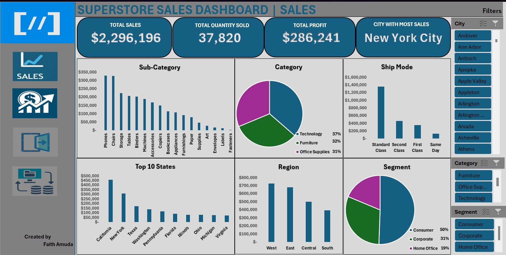

# **Customer Sales Analysis**

## **Table of content**
- [Project Overview](#project-overview)
- [Problem Statement](#problem-statement)
- [Tools Used](#tools-used)
- [Data Cleaning](#data-cleaning)
- [Exploratory Data Analysis](#exploratory-data-analysis)
- [Key Insights](#key-insights)
- [Dashboard and Data Visualization](#dashboard-and-data-visualization)
- [Recommendations](#recommendations)
- [How to Use](#how-to-use)

## **Project Overview**
This project provides actionable insights from a retail sales dataset obtained from Kaggle. The dataset includes detailed records on product sales, profitability, customer segments, and regional trends. The main objective is to identify key sales patterns and recommend strategies to optimize revenue and profit.

## **Problem Statement**
Retail businesses need to understand which products sell best, where sales are highest, and how discounts impact profit to make informed decisions. This analysis aims to uncover:
- Top-performing products and categories
- Regional sales performance
- Customer segment contributions
- Discount and profitability trends

## **Tools Used**
**Microsoft Excel:** Primary tool for data cleaning, exploration, pivot analysis, and visualization.

**Pivot Tables:** For in-depth breakdowns of sales, profit, discount, and regional performance.

**Charts & Dashboard:** For interactive visuals and executive summaries to communicate insights effectively.

## **Data Cleaning**
- Checked for and removed duplicate records to ensure accuracy.
- Handled missing values by verifying data consistency (e.g., no blank product names or sales figures).
- Standardized categorical values (e.g., product categories and region names) for consistency in pivot tables.
- Verified numerical fields (sales, profit, discount) for outliers and corrected obvious data entry errors.

## **Exploratory Data Analysis:**
- Created Pivot Tables to analyze sales, profit, and discounts by product, category, region, and segment.
- Visualized trends with bar charts, pie charts, and line graphs for easy stakeholder interpretation.
- Identified relationships between discount rates and profit margins.
- Segmented data to reveal high-revenue customer groups.

## **Key Insights**
**Best-Selling Products:**
- Technology is the top category (37% of total sales), followed by Furniture (32%) and Office Supplies (31%).
- Phones generated the highest revenue at $330,000.

**Profitability:**
- Copiers are the most profitable item, earning $55,618 profit with a 32% margin.
- Tables and Bookcases show profit losses due to excessive discounts.

**Regional Trends:**
- West region contributes 32% of total sales.
- South region has the lowest sales — highlighting growth potential.

**Discounts Impact:**
- Discounts above 17% lead to negative profit margins.

**Customer Segments:**
- Consumers segment accounts for 50% of total revenue.

## **Dashboard and Data Visualization**
The final interactive dashboard was created in Microsoft Excel using charts, slicers, and pivot charts. Below is a snapshot of the dashboard:

[Dashboard](https://onedrive.live.com/personal/7177f5caf8d99464/_layouts/15/Doc.aspx?sourcedoc=%7Bef5caaa3-38c2-495d-8dac-fd50fe9b523b%7D&action=default&redeem=aHR0cHM6Ly8xZHJ2Lm1zL3gvYy83MTc3ZjVjYWY4ZDk5NDY0L0VhT3FYT19DT0YxSmphejlVUDZiVWpzQnlRMEpralRuY0FMd0RXal9acW9RdEE_ZT10Ylh1YWE&slrid=2fb0ada1-7031-d000-0ce9-14e061a21e4c&originalPath=aHR0cHM6Ly8xZHJ2Lm1zL3gvYy83MTc3ZjVjYWY4ZDk5NDY0L0VhT3FYT19DT0YxSmphejlVUDZiVWpzQnlRMEpralRuY0FMd0RXal9acW9RdEE_cnRpbWU9S0VYRkxRdTUzVWc&CID=95738b5f-f89a-445f-b99f-076d2144b746&_SRM=0:G:82)
## **Recommendations**
**Maximize Best-Selling Categories & Regions:**
- Boost stock and promotions for Phones and Copiers.
- Expand marketing in the West region.

**Address Low Performance:**
- Adjust pricing strategies for Tables and Bookcases.
- Launch targeted campaigns in the South region.

**Optimize Discounts:**
- Limit discounts above 17% to safeguard profits.

**Engage High-Value Customers:**
- Introduce personalized offers and loyalty programs for the Consumers segment.

## **How to Use**
- Download the dataset (or access it via Kaggle) in /data.
- Open /dashboard/ to interact with the visual dashboard and charts.
- Review insights and recommendations in this README.
